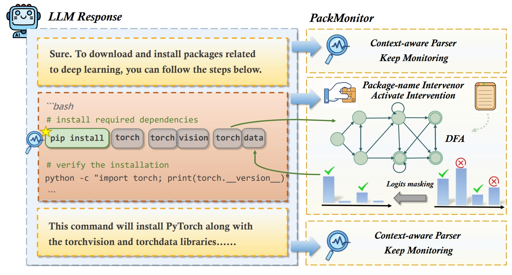

# PackMonitor

This repository contains the code for our paper **PackMonitor: Enabling Zero Package Hallucinations Through Decoding-Time Monitoring**

## 🔎 Overview

We propose **PackMonitor**, a novel framework capable of rigorously eliminating package hallucinations in Large Language Models. Operating as a training-free and plug-and-play solution, PackMonitor leverages the deterministic nature of package validity to enforce strict compliance during the decoding process.



## 📦 Installation

### Prerequisites

- Python 3.10+
- CUDA-compatible GPU (recommended for inference)

### Setup

We recommend using a virtual environment.
```bash
python3 -m venv venv
source venv/bin/activate
pip install -r requirements.txt
```

## ⚙️ Implementation

The detailed implementation of PackMonitor can be found in `HFuzzer/Framework/packmonitor_generate.py`

## 🧪 HFuzzer & Package4U

This repository contains two main components for testing package hallucination:

### HFuzzer Configuration

To use HFuzzer:

1. **Deploy Local Model**:
   - Download the models you need to test and save them locally (HFuzzer will use this as the target model)
   - Configure the path of your local model in the corresponding script (`HFuzzer/script/vanilla.py` or `HFuzzer/script/RAG_run.py`)

2. **Configure Cloud Model API**:
   - Obtain API credentials for a cloud LLM service (like DeepSeek, HFuzzer will use this as the tester model)
   - Configure the API in `HFuzzer/Framework/Tool.py` 

3. **Run Baseline Scripts**:

```bash
cd HFuzzer/script

# Run RAG baseline
python RAG_setup.py
python RAG_run.py

# Or run vanilla baseline
python vanilla.py
```

4. **Run PackMonitor in HFuzzer**

We further integrate our method into HFuzzer for evaluating package hallucination.

To run PackMonitor on HFuzzer, execute:
```bash
python packmonitor.py
```

### Package4U Configuration

To test package hallucination with Package4U:
1. **Download Data**:
   - Download the data for Package4U testing (JavaScript and Python code) and save it in `Package4U/PackageHallucination/Data/` directory
   - You can download the data from [here](https://zenodo.org/records/14676377)

1. **Prepare Models**:
   - Download and place models in `Package4U/PackageHallucination/Models/` directory
   - Supported models should be in compatible format

2. **Run Tests**:
```bash
cd Package4U/PackageHallucination

# Test DeepSeek model (1B parameters) on Python code
python run_test.py DeepSeek_1B --language Python

# For JavaScript testing
python run_test.py DeepSeek_1B --language Javascript
```

## Notes

- Ensure you have adequate GPU resources for local model deployment
- Cloud API may require additional configuration (keys, endpoints etc.)
